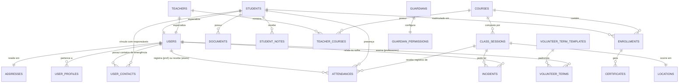

# 🗄️ Modelagem de Dados - CECOR

**Fonte de Referência**: [Visão Geral do Sistema CECOR](https://docs.google.com/document/d/1Gio0Q8gx2xZFEQgWofmguKxnvV2ePZU0WDEGFvu8520/edit)
**Data da última análise**: 2025-02-17

Este documento descreve a arquitetura do banco de dados do sistema CECOR, as relações entre entidades e as diretrizes de segurança de dados.

---

## 🗺️ Diagrama de Entidade-Relacionamento (ER)

---

## 🏛️ Estrutura das Entidades Principais

### 1. Núcleo de Usuários e Identidade

| Tabela          | Descrição                       | Principais Campos                                |
| :-------------- | :------------------------------ | :----------------------------------------------- |
| `users`         | Base central de pessoas.        | `id`, `name`, `email`, `cpf`, `keycloak_user_id` |
| `addresses`     | Endereço físico (1:1 com user). | `street`, `neighborhood`, `city`, `state`, `cep` |
| `user_profiles` | Permissões e papéis (RBAC).     | `profile_type` (admin, professor, student)       |

### 2. Gestão Acadêmica

| Tabela              | Descrição                       | Principais Campos                                                    |
| :------------------ | :------------------------------ | :------------------------------------------------------------------- |
| `students`          | Especialização de usuário.      | `registration_number`, `status`                                      |
| `guardians`         | Responsáveis pelos alunos.      | `name`, `relationship`, `phone`, `cpf`                               |
| `students`          | Especialização de usuário.      | `registration_number`, `status`                                      |
| `courses`           | Disciplinas ou oficinas.        | `name`, `start_date`, `end_date`, `workload`, `google_classroom_url` |
| `class_sessions`    | Aulas específicas (Cronograma). | `date`, `topic` (ementa), `is_cancelled`, `location_id`              |
| `locations`         | Salas e Espaços Físicos.        | `name`, `capacity`, `resources` (projetor, pia, etc)                 |
| `academic_calendar` | Feriados e Eventos Globais.     | `date`, `description`, `is_holiday`                                  |
| `enrollments`       | Elos entre Aluno e Curso.       | `status`, `enrollment_number`, `start_date`                          |

### 3. Gestão de Professores e Voluntariado

| Tabela            | Descrição                             | Principais Campos                                   |
| :---------------- | :------------------------------------ | :-------------------------------------------------- |
| `teachers`        | Especialização de voluntário.         | `academic_background`, `proficiencies`, `phone`     |
| `teacher_courses` | Alocação professor-disciplina.        | `teacher_id`, `course_id`, `role`                   |
| `volunteer_terms` | Formalização jurídica (Lei 9.608/98). | `signed_at`, `expiration_date`, `status`            |
| `user_contacts`   | Contatos de emergência/responsáveis.  | `name`, `relationship`, `phone`, `user_id`          |
| `incidents`       | Ocorrências (Alunos ou Infra).        | `occurred_at`, `type`, `status`, `class_session_id` |

### 4. Armazenamento Flexível (MongoDB)

O MongoDB será o motor oficial para **Formulários Dinâmicos** e **Entrevistas**, substituindo as tabelas relacionais (`forms`, `form_questions`, etc.) que constam no schema legado.

| Coleção               | Tabela SQL Correspondente (Legado)       | Descrição                          |
| :-------------------- | :--------------------------------------- | :--------------------------------- |
| `form_definitions`    | `forms` / `form_questions`               | Estrutura de perguntas e versões.  |
| `interview_responses` | `form_responses` / `form_answer_details` | Coleta de respostas em JSON livre. |

---

## 🔍 Análise de Normalização (Forms)

| Nível   | Status      | Observações                                                                 |
| :------ | :---------- | :-------------------------------------------------------------------------- |
| **1NF** | ✅ Atendido | Todos os campos são atômicos. Sem grupos repetitivos.                       |
| **2NF** | ✅ Atendido | Dependência total da PK. Ex: Endereço separado de Usuário.                  |
| **3NF** | ⚠️ Parcial  | Existem redundâncias por design: `registrations` (legado) vs `enrollments`. |

> [!WARNING]
> **Redundância Crítica**: As tabelas `registrations` e `attendance` (singular) são legados de compatibilidade. Recomenda-se a migração total para `enrollments` e `attendances` para evitar divergência de dados.

---

## 🛡️ Segurança e LGPD

### Campos Sensíveis (PII)

- **Criptografia Necessária**: `users.cpf`, `users.phone`, `guardians.cpf`.
- **Privacidade**: `student_notes.is_confidential` deve ser estritamente respeitado no backend.

### Dados Sensíveis de Saúde

- **Tabela**: `students`.
- **Campos**: `special_needs`, `medical_info`.
- **Risco**: Dados de categoria especial (Art. 5º LGPD). Devem ter controle de acesso rigoroso e logs de auditoria.

### Gestão de Voluntários e Lei 9.608/98

- **Termo de Voluntariado**: Essencial para evitar o reconhecimento de vínculo empregatício. O sistema deve bloquear a alocação em cursos (`teacher_courses`) se o `volunteer_terms` não estiver ativo.
- **Formação e Proficiência**: Os campos `academic_background` e `proficiencies` permitem à gerência filtrar voluntários por competência, facilitando a abertura de novas oficinas.

### Endereço e Emergência

- **Residência**: O endereço é coletado via `addresses` vinculado ao `users`.
- **Contatos (Emergency/Guardians)**: A tabela `guardians` foi abstraída logicamente para `user_contacts` (ou campo `user_id` na mesma tabela), permitindo que tanto alunos (responsáveis) quanto professores (contatos de emergência) utilizem a mesma estrutura.

### Comunicação e Notificações (Multicanal)

- **Canais**: Telegram, E-mail, SMS, Push.
- **Rastreabilidade**: Todas as notificações são registradas na tabela `notifications` com seu status de entrega.

### Cronograma e Ementas (Novo)

Para transformar a regra "Toda Quarta-feira" em um calendário real (como na imagem de referência):

- **Tabela**: `class_sessions`.
- **Função**: Materializa cada dia de aula. Permite definir o tema do dia (`topic` ou ementa) e marcar exceções de datas.
- **Salas (`Locations`)**: Resolve o problema "não sabemos em que sala será". Cada sessão pode ser alocada em uma sala diferente se necessário (ex: aula prática no Pátio, teórica na Sala 1).
- **Presença**: A presença (`attendances`) passa a ser vinculada a uma `class_session_id` específica, facilitando a impressão da "Folha de Presença do Dia".

### Gestão de Ocorrências (`Incidents`)

- **Problema**: "Existência de problemas com alunos ou infraestrutura".
- **Solução**: Nova tabela `incidents` para registrar desde "Aluno brigou na aula" até "Torneira do banheiro quebrada".
  - **Vínculo Opcional com Aula**: O campo `class_session_id` será **opcional**.
    - _Cenário Professor_: Registra ocorrência DENTRO da aula (vincula à sessão).
    - _Cenário Monitor/Diretoria_: Registra ocorrência genérica (ex: "Corredor sujo") SEM vínculo com aula específica.
  - Campos: `reported_by` (quem viu), `type` (infraestrutura, disciplinar), `status` (aberto, resolvido).

### Auditoria

- **Tabela**: `audit_logs`.
- **Mecanismo**: Registra `old_data` e `new_data` em formato JSONB para rastreabilidade de mudanças.

---

## 🚀 Propostas de Melhoria

1. **Expurgo de Legado**: Remover tabelas `registrations` e `attendance`.
2. **Uso de Enums Natas**: Onde possível, trocar `VARCHAR` por `ENUM` (PostgreSQL) para `status` e `profile`.
3. **Indexação Geográfica**: Se o volume de endereços crescer, indexar `cep` para buscas regionais.
