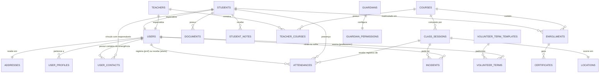

```mermaid
erDiagram
    USERS ||--|| ADDRESSES : "reside em"
    USERS ||--o{ USER_PROFILES : "pertence a"
    USERS ||--o{ USER_CONTACTS : "possui contatos de emergência"
    USERS ||--o{ ATTENDANCES : "registra (prof) ou recebe (aluno)"

    STUDENTS ||--|| USERS : "especializa"
    TEACHERS ||--|| USERS : "especializa"
    STUDENTS ||--o{ USER_CONTACTS : "vínculo com responsáveis"
    STUDENTS ||--o{ ENROLLMENTS : "matriculado em"
    STUDENTS ||--o{ DOCUMENTS : "possui"
    STUDENTS ||--o{ STUDENT_NOTES : "recebe"

    STUDENTS ||--o{ ATTENDANCES : "presença"

    COURSES ||--o{ ENROLLMENTS : "contém"
    TEACHERS ||--o{ TEACHER_COURSES : "ministra"
    COURSES ||--o{ TEACHER_COURSES : "possui"
    COURSES ||--o{ CLASS_SESSIONS : "composto por"
    CLASS_SESSIONS ||--o{ ATTENDANCES : "recebe registros de"
    CLASS_SESSIONS ||--|| LOCATIONS : "ocorre em"
    CLASS_SESSIONS ||--o{ INCIDENTS : "pode ter"

    GUARDIANS ||--|| GUARDIAN_PERMISSIONS : "configura"
    USERS ||--o{ INCIDENTS : "relata ou sofre"
    ENROLLMENTS ||--o{ CERTIFICATES : "gera"

    VOLUNTEER_TERM_TEMPLATES ||--o{ VOLUNTEER_TERMS : "padroniza"
    USERS ||--o{ VOLUNTEER_TERMS : "assina (professores)"
```

---