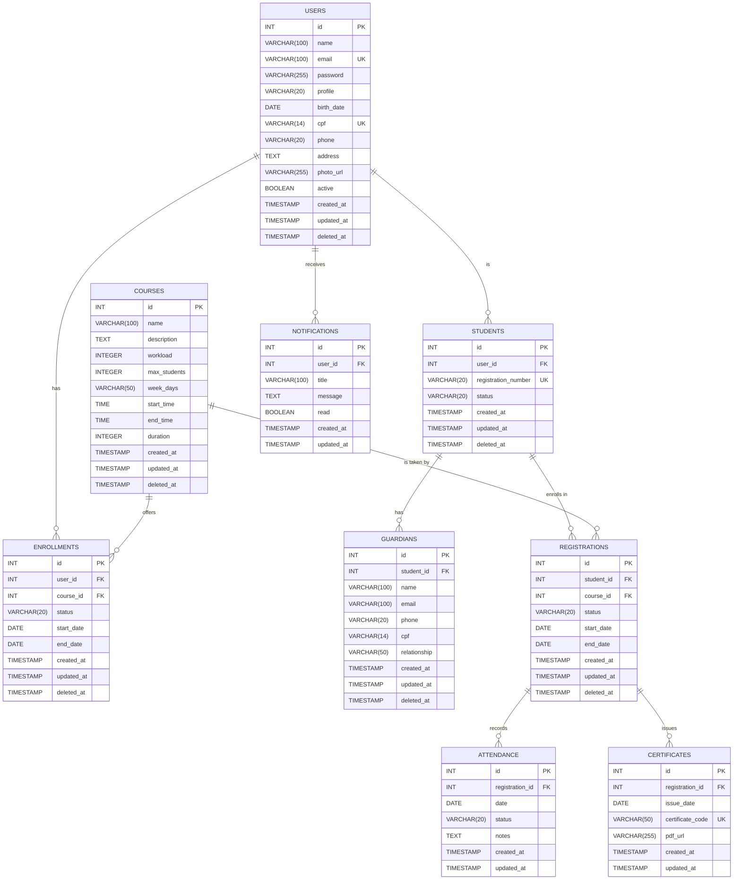

```mermaid
erDiagram

USERS {
    INT id PK
    VARCHAR(100) name
    VARCHAR(100) email UK
    VARCHAR(255) password
    VARCHAR(20) profile
    DATE birth_date
    VARCHAR(14) cpf UK
    VARCHAR(20) phone
    TEXT address
    VARCHAR(255) photo_url
    BOOLEAN active
    TIMESTAMP created_at
    TIMESTAMP updated_at
    TIMESTAMP deleted_at
}

COURSES {
    INT id PK
    VARCHAR(100) name
    TEXT description
    INTEGER workload
    INTEGER max_students
    VARCHAR(50) week_days
    TIME start_time
    TIME end_time
    INTEGER duration
    TIMESTAMP created_at
    TIMESTAMP updated_at
    TIMESTAMP deleted_at
}

ENROLLMENTS {
    INT id PK
    INT user_id FK
    INT course_id FK
    VARCHAR(20) status
    DATE start_date
    DATE end_date
    TIMESTAMP created_at
    TIMESTAMP updated_at
    TIMESTAMP deleted_at
}

STUDENTS {
    INT id PK
    INT user_id FK
    VARCHAR(20) registration_number UK
    VARCHAR(20) status
    TIMESTAMP created_at
    TIMESTAMP updated_at
    TIMESTAMP deleted_at
}

GUARDIANS {
    INT id PK
    INT student_id FK
    VARCHAR(100) name
    VARCHAR(100) email
    VARCHAR(20) phone
    VARCHAR(14) cpf
    VARCHAR(50) relationship
    TIMESTAMP created_at
    TIMESTAMP updated_at
    TIMESTAMP deleted_at
}

REGISTRATIONS {
    INT id PK
    INT student_id FK
    INT course_id FK
    VARCHAR(20) status
    DATE start_date
    DATE end_date
    TIMESTAMP created_at
    TIMESTAMP updated_at
    TIMESTAMP deleted_at
}

ATTENDANCE {
    INT id PK
    INT registration_id FK
    DATE date
    VARCHAR(20) status
    TEXT notes
    TIMESTAMP created_at
    TIMESTAMP updated_at
}

CERTIFICATES {
    INT id PK
    INT registration_id FK
    DATE issue_date
    VARCHAR(50) certificate_code UK
    VARCHAR(255) pdf_url
    TIMESTAMP created_at
    TIMESTAMP updated_at
}

NOTIFICATIONS {
    INT id PK
    INT user_id FK
    VARCHAR(100) title
    TEXT message
    BOOLEAN read
    TIMESTAMP created_at
    TIMESTAMP updated_at
}

USERS ||--o{ ENROLLMENTS : "has"
USERS ||--o{ STUDENTS : "is"
COURSES ||--o{ ENROLLMENTS : "offers"
STUDENTS ||--o{ GUARDIANS : "has"
STUDENTS ||--o{ REGISTRATIONS : "enrolls in"
COURSES ||--o{ REGISTRATIONS : "is taken by"
REGISTRATIONS ||--o{ ATTENDANCE : "records"
REGISTRATIONS ||--o{ CERTIFICATES : "issues"
USERS ||--o{ NOTIFICATIONS : "receives"

```